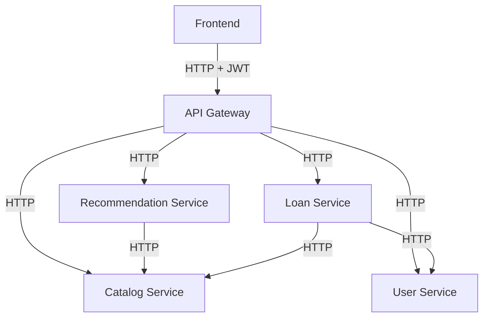

# Deployment Guide (Render Free)

## Architecture Diagram



## Authentication Flow

1. Client calls `POST /auth/login` with email + password.
2. API Gateway forwards to User Service which validates credentials.
3. User Service returns a signed JWT (8h expiry) containing `user_id`, `email`, `role`.
4. Client stores the token and sends it in `Authorization: Bearer <token>` on subsequent requests.
5. API Gateway validates the token and extracts the role before forwarding to downstream services.

## Role Permissions

| Role  | Allowed Actions |
|-------|----------------|
| ADMIN | Full access: create books, manage users, dashboard, all loans |
| USER  | Browse catalog, search, request loans, view own history |

## Service Communication Flow

1. Frontend → API Gateway (all requests with JWT when authenticated).
2. API Gateway → Catalog / Loans / Recommendation / User Services (internal HTTP, no JWT).
3. Loan Service → Catalog Service (to check/update availability).
4. Loan Service → User Service (optional: resolve user name from user_id).
5. Recommendation Service → Catalog Service (to fetch books by category).

## Local Setup

1. Create a virtual environment and install dependencies:
   ```bash
   python -m venv .venv
   source .venv/bin/activate
   pip install -r requirements.txt
   ```
2. Create a `.env` using `.env.example` as a reference. **Set `JWT_SECRET` to a strong random value.**
3. Run each service in a separate terminal:
   ```bash
   python -m servico_catalogo.app
   python -m servico_emprestimos.app
   python -m servico_recomendacao.app
   python -m servico_usuario.app
   python -m api_gateway.app
   ```
4. Run the frontend:
   ```bash
   cd frontend
   npm install
   npm run dev
   ```

## Render Deployment (Free)

1. Push the repository to GitHub.
2. In Render, create a new Blueprint using `render.yaml`.
3. **Set the `JWT_SECRET` environment variable** (marked `sync: false`) in the Render dashboard for both `api-gateway` and `user-service`. Use the same strong random string for both.
4. Update the `USER_SERVICE_URL` values in `render.yaml` with the actual deployed URL of `user-service` once it is created.
5. Confirm all inter-service URLs and `CORS_ORIGINS`.

### Render start commands

- `gunicorn --chdir .. api_gateway.app:app`
- `gunicorn --chdir .. servico_catalogo.app:app`
- `gunicorn --chdir .. servico_emprestimos.app:app`
- `gunicorn --chdir .. servico_recomendacao.app:app`
- `gunicorn --chdir .. servico_usuario.app:app`

## Environment Variables

### Common
- `PORT` — set automatically by Render.
- `CORS_ORIGINS` — comma-separated allowed origins.
- `JWT_SECRET` — **shared secret** used by API Gateway and User Service. Must be identical. Keep this secure.

### API Gateway
- `CATALOG_SERVICE_URL`
- `LOANS_SERVICE_URL`
- `RECOMMENDATION_SERVICE_URL`
- `USER_SERVICE_URL`

### Catalog Service
- `CATALOGO_DB_PATH`

### Loan Service
- `EMPRESTIMOS_DB_PATH`
- `CATALOG_SERVICE_URL`
- `USER_SERVICE_URL`

### User Service
- `USUARIO_DB_PATH`

### Recommendation Service
- `CATALOG_SERVICE_URL`

## Manual Migration Steps

Existing SQLite databases will be migrated automatically on startup:
- The Loan Service adds `user_id`, `data_emprestimo`, `data_devolucao` columns via `ALTER TABLE` if missing.
- No manual migration is required for existing data. `nome_usuario` remains valid.

## Creating the First Admin User

After deploying, create an admin user directly via the User Service (or the Gateway):

```bash
curl -X POST https://<gateway-url>/usuarios \
  -H "Content-Type: application/json" \
  -d '{
    "full_name": "Admin",
    "email": "admin@yourdomain.com",
    "cpf": "00000000000",
    "password": "strong-password",
    "role": "ADMIN"
  }'
```

## Troubleshooting

- **502 on Gateway**: Verify all service URLs and check Render service health.
- **401 Unauthorized**: Include `Authorization: Bearer <token>` header. Token may be expired (8h).
- **403 Forbidden**: The action requires ADMIN role. Log in with an admin account.
- **CORS errors**: Confirm `CORS_ORIGINS` includes the frontend URL and `API_GATEWAY_URL` in `frontend/.env.local`.
- **JWT_SECRET mismatch**: Ensure `api-gateway` and `user-service` share the same `JWT_SECRET`.
- **Render free instances sleep**: First request after inactivity may be slow.

