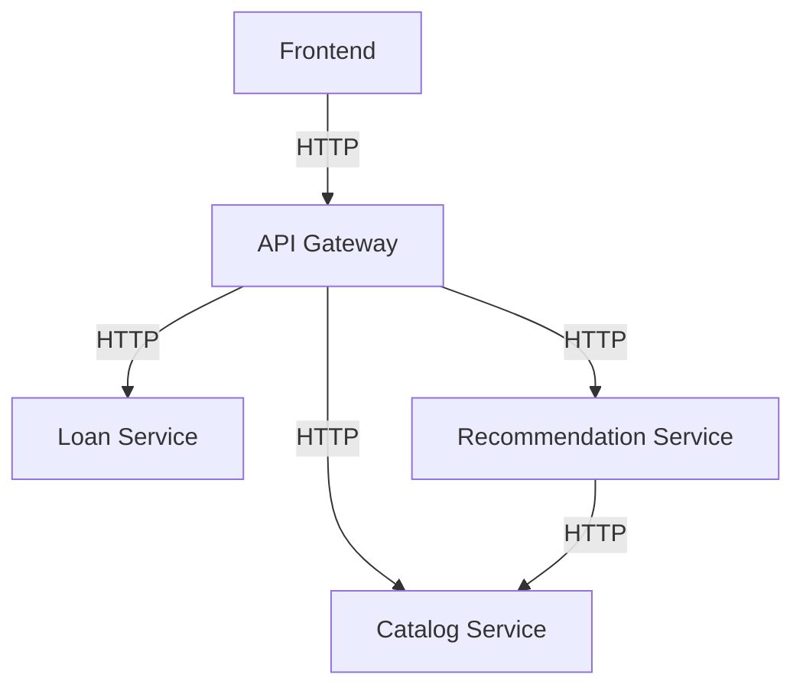

# Deployment Guide (Render Free)

## Architecture Diagram

## Service Communication Flow

1. Frontend sends requests to the API Gateway.
2. API Gateway forwards requests to the proper microservice.
3. Recommendation Service queries the Catalog Service for data.

## Local Setup

1. Create a virtual environment and install dependencies:
   - `python -m venv .venv`
   - `source .venv/bin/activate`
   - `pip install -r requirements.txt`
2. Create a `.env` using `.env.example` as a reference.
3. Run each service in a separate terminal:
   - `python -m servico_catalogo.app`
   - `python -m servico_emprestimos.app`
   - `python -m servico_recomendacao.app`
   - `python -m api_gateway.app`
4. Run the frontend in another terminal:
   - `cd frontend`
   - `npm install`
   - `npm run dev`

## Render Deployment (Free)

1. Push the repository to GitHub.
2. In Render, create a new Blueprint using `render.yaml`.
3. Wait for all services to build and deploy.
4. Configure frontend environment variables:
   - Create `frontend/.env.local` based on [frontend/.env.example](frontend/.env.example).
   - Set `API_GATEWAY_URL` to the Gateway public URL.
5. In Render, confirm the environment variables (especially URLs and CORS origins).

### Render start commands

Use package-qualified Gunicorn targets so Python keeps package context for relative imports:

- `gunicorn --chdir .. api_gateway.app:app`
- `gunicorn --chdir .. servico_catalogo.app:app`
- `gunicorn --chdir .. servico_emprestimos.app:app`
- `gunicorn --chdir .. servico_recomendacao.app:app`

## Environment Variables

Common:
- `PORT`: Render sets this automatically.
- `CORS_ORIGINS`: Comma-separated list of allowed origins.

Gateway:
- `CATALOG_SERVICE_URL`
- `LOANS_SERVICE_URL`
- `RECOMMENDATION_SERVICE_URL`

Catalog:
- `CATALOGO_DB_PATH`

Loans:
- `EMPRESTIMOS_DB_PATH`

Recommendation:
- `CATALOG_SERVICE_URL`

## Troubleshooting

- If the gateway returns 502, verify the service URLs and that services are healthy.
- If the frontend cannot call the gateway, confirm `CORS_ORIGINS` and `API_GATEWAY_URL` in `frontend/.env.local`.
- Render free instances can sleep; the first request may take longer.
