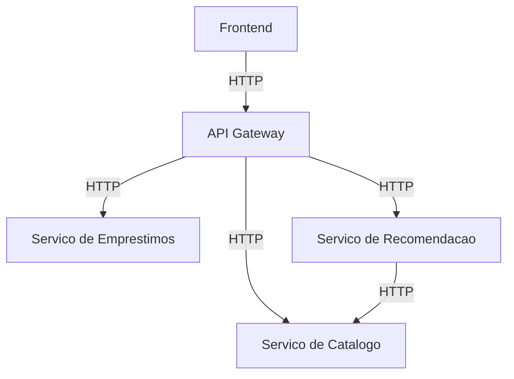

# Biblioteca Microservicos

Sistema simples de gerenciamento de biblioteca online usando Microservicos com Flask. O projeto foca em separacao clara de responsabilidades, comunicacao via HTTP e resposta consistente em JSON.

## Visao Geral da Arquitetura

1. **API Gateway (5000)**: ponto de entrada unico e roteamento das requisicoes.
2. **Servico de Catalogo (5001)**: cadastro e consulta de livros.
3. **Servico de Emprestimos (5002)**: registro e devolucao de emprestimos.
4. **Servico de Recomendacao (5003)**: filtragem de livros por categoria com base no catalogo.
5. **Frontend**: aplicacao Next.js para interface web robusta e integracao via API Gateway.



## Estrutura de Pastas

```
biblioteca-microservicos/
├── api_gateway/
│   ├── app.py
│   └── routes/
├── servico_catalogo/
│   ├── app.py
│   ├── models.py
│   ├── services.py
│   └── routes.py
├── servico_emprestimos/
│   ├── app.py
│   ├── models.py
│   ├── services.py
│   └── routes.py
├── servico_recomendacao/
│   ├── app.py
│   ├── services.py
│   └── routes.py
├── frontend/
│   ├── app/
│   ├── lib/
│   ├── package.json
│   └── .env.example
├── tests/
├── requirements.txt
├── README.md
└── copilot-instructions.md
```

## Instalacao

Requisitos: **Python 3.12+**.

```
python -m venv .venv
source .venv/bin/activate
pip install -r requirements.txt
```

Crie um arquivo `.env` baseado em `.env.example` para configurar URLs e CORS.

## Executando os Servicos

Abra terminais separados e execute:

```
python -m servico_catalogo.app
python -m servico_emprestimos.app
python -m servico_recomendacao.app
python -m api_gateway.app
```

Em outro terminal, execute o frontend Next.js:

```
cd frontend
npm install
npm run dev
```

Por padrao, o frontend usa a rota interna `/api` para encaminhar chamadas para o Gateway. Para configurar o host do Gateway, ajuste `API_GATEWAY_URL` no arquivo `.env.local` em [frontend/.env.example](frontend/.env.example).

## Deploy (Render Free)

O repositorio inclui um blueprint em [render.yaml](render.yaml) com quatro servicos independentes.
Passos resumidos:

1. Suba o repositorio no GitHub.
2. Crie um Blueprint no Render usando o `render.yaml`.
3. Confirme as variaveis de ambiente, principalmente as URLs entre servicos e `CORS_ORIGINS`.
4. Atualize o `api-base` do frontend com a URL publica do gateway.

Consulte detalhes em [DEPLOYMENT.md](DEPLOYMENT.md).

## Formato de Resposta

As respostas seguem o mesmo padrao:

```
{
  "success": true,
  "data": {}
}
```

Erros:

```
{
  "success": false,
  "message": "Descricao do problema"
}
```

## Exemplos de API

Cadastrar livro:

```
curl -X POST http://localhost:5000/livros \
  -H "Content-Type: application/json" \
  -d '{"titulo":"Dom Casmurro","autor":"Machado de Assis","categoria":"Classico"}'
```

Listar livros:

```
curl http://localhost:5000/livros
```

Criar emprestimo:

```
curl -X POST http://localhost:5000/emprestimos \
  -H "Content-Type: application/json" \
  -d '{"nome_usuario":"Ana","livro_id":"ID_DO_LIVRO"}'
```

Devolver emprestimo:

```
curl -X POST http://localhost:5000/devolucoes \
  -H "Content-Type: application/json" \
  -d '{"emprestimo_id":"ID_DO_EMPRESTIMO"}'
```

Recomendacoes:

```
curl http://localhost:5000/recomendacoes/Ficcao
```

## Tests

```
pytest
```

## Screenshots

### Pagina inicial

### Cadastro de livros

### Emprestimos e recomendacoes

## Melhorias Futuras

1. Persistencia compartilhada via banco dedicado para catalogo e emprestimos.
2. Validacoes adicionais (ex.: verificar disponibilidade antes de emprestar).
3. Observabilidade com logs estruturados e metricas.
4. Autenticacao e autorizacao para acesso a recursos.
