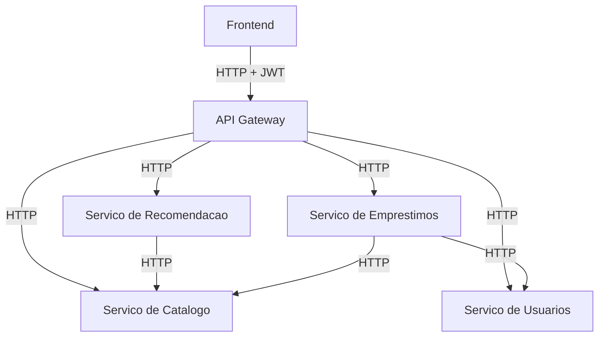
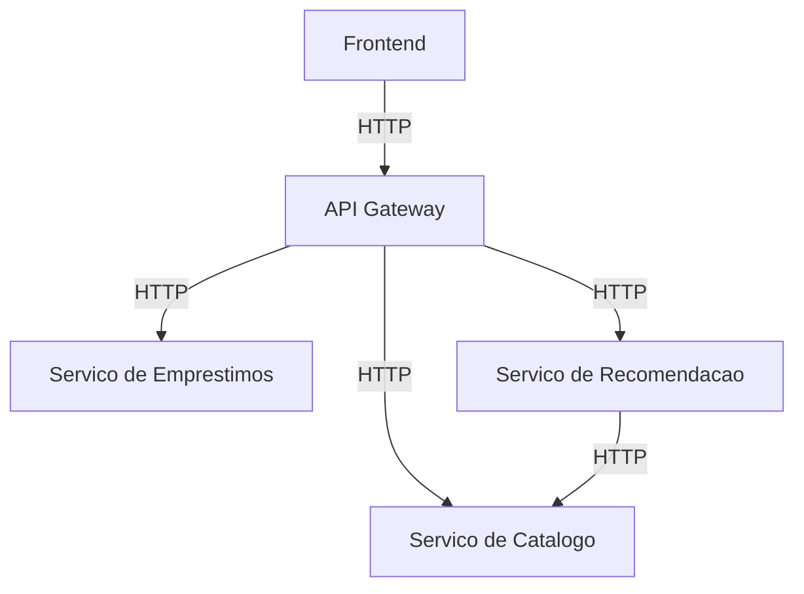

# Biblioteca Microservicos

Sistema de gerenciamento de biblioteca online com Microservicos, autenticacao JWT e controle de acesso por perfil.

## Visao Geral da Arquitetura

1. **API Gateway (5000)**: ponto de entrada unico, roteamento e validacao JWT.
2. **Servico de Catalogo (5001)**: cadastro, consulta e filtros de livros.
3. **Servico de Emprestimos (5002)**: emprestimos, devolucoes, reservas e historico.
4. **Servico de Recomendacao (5003)**: filtragem de livros por categoria.
5. **Servico de Usuarios (5004)**: gestao de usuarios e autenticacao JWT.
6. **Frontend**: aplicacao Next.js com login, dashboard e modulos de negocio.



## Perfis e Permissoes

| Perfil | Permissoes |
|--------|-----------|
| ADMIN  | Criar livros, gerenciar usuarios, ver dashboard, todos os emprestimos, relatorios |
| USER   | Navegar catalogo, buscar livros, ver disponibilidade, solicitar emprestimos, ver proprio historico |

## Autenticacao

1. `POST /auth/login` — retorna token JWT (8 horas de validade).
2. Incluir o token em todas as requisicoes protegidas: `Authorization: Bearer <token>`.
3. O Gateway valida o token e verifica o perfil antes de encaminhar.

## Estrutura de Pastas

```
biblioteca-microservicos/
├── api_gateway/
│   ├── app.py
│   └── routes/
├── servico_catalogo/
│   ├── app.py, models.py, services.py, routes.py
├── servico_emprestimos/
│   ├── app.py, models.py, services.py, routes.py
├── servico_recomendacao/
│   ├── app.py, services.py, routes.py
├── servico_usuario/
│   ├── app.py, models.py, services.py, routes.py
├── frontend/
│   ├── app/
│   │   ├── catalogo/, emprestimos/, recomendacoes/
│   │   ├── login/, registro/, dashboard/
│   └── lib/
├── tests/
├── requirements.txt
└── render.yaml
```

## Instalacao

Requisitos: **Python 3.12+**.

```bash
python -m venv .venv
source .venv/bin/activate
pip install -r requirements.txt
```

Copie `.env.example` para `.env` e ajuste as variaveis.

## Executando os Servicos

```bash
python -m servico_catalogo.app       # porta 5001
python -m servico_emprestimos.app    # porta 5002
python -m servico_recomendacao.app   # porta 5003
python -m servico_usuario.app        # porta 5004
python -m api_gateway.app            # porta 5000
```

Frontend:

```bash
cd frontend
npm install
npm run dev
```

## Formato de Resposta

```json
{ "success": true, "data": {} }
{ "success": false, "message": "Descricao do problema" }
```

## Exemplos de API

**Login:**
```bash
curl -X POST http://localhost:5000/auth/login \
  -H "Content-Type: application/json" \
  -d '{"email":"admin@example.com","password":"admin123"}'
```

**Cadastrar usuario:**
```bash
curl -X POST http://localhost:5000/usuarios \
  -H "Content-Type: application/json" \
  -d '{"full_name":"Ana Lima","email":"ana@ex.com","cpf":"12345678901","password":"senha123"}'
```

**Cadastrar livro (requer ADMIN):**
```bash
curl -X POST http://localhost:5000/livros \
  -H "Content-Type: application/json" \
  -H "Authorization: Bearer <token>" \
  -d '{"titulo":"Dom Casmurro","autor":"Machado de Assis","categoria":"Classico"}'
```

**Buscar livros com filtros:**
```bash
curl "http://localhost:5000/livros?titulo=dom"
curl "http://localhost:5000/livros?autor=machado"
curl "http://localhost:5000/livros?categoria=romance"
curl "http://localhost:5000/livros?disponivel=true"
curl "http://localhost:5000/livros?categoria=classico&autor=machado"
```

**Criar emprestimo (requer autenticacao):**
```bash
curl -X POST http://localhost:5000/emprestimos \
  -H "Content-Type: application/json" \
  -H "Authorization: Bearer <token>" \
  -d '{"user_id":"ID_DO_USUARIO","livro_id":"ID_DO_LIVRO"}'
```

**Historico de emprestimos:**
```bash
curl "http://localhost:5000/usuarios/<id>/historico-emprestimos" \
  -H "Authorization: Bearer <token>"
curl "http://localhost:5000/livros/<id>/historico-emprestimos" \
  -H "Authorization: Bearer <token>"
```

**Dashboard (requer ADMIN):**
```bash
curl http://localhost:5000/dashboard \
  -H "Authorization: Bearer <token>"
```

## Novos Endpoints

| Metodo | Rota | Permissao | Descricao |
|--------|------|-----------|-----------|
| POST | /auth/login | Publico | Login e retorno de JWT |
| POST | /usuarios | Publico | Cadastro de usuario |
| GET | /usuarios | ADMIN | Listar todos os usuarios |
| GET | /usuarios/{id} | AUTH | Buscar usuario por ID |
| PUT | /usuarios/{id} | AUTH | Atualizar usuario |
| DELETE | /usuarios/{id} | ADMIN | Excluir usuario |
| GET | /usuarios/{id}/historico-emprestimos | AUTH | Historico de emprestimos do usuario |
| GET | /livros | Publico | Listar/filtrar livros (titulo, autor, categoria, disponivel) |
| GET | /livros/{id}/historico-emprestimos | AUTH | Historico de emprestimos do livro |
| GET | /dashboard | ADMIN | Metricas agregadas de todos os servicos |

## Testes

```bash
pytest
```

## Deploy (Render Free)

Consulte [DEPLOYMENT.md](DEPLOYMENT.md) para instrucoes completas.


## Visao Geral da Arquitetura

1. **API Gateway (5000)**: ponto de entrada unico e roteamento das requisicoes.
2. **Servico de Catalogo (5001)**: cadastro e consulta de livros.
3. **Servico de Emprestimos (5002)**: registro e devolucao de emprestimos.
4. **Servico de Recomendacao (5003)**: filtragem de livros por categoria com base no catalogo.
5. **Frontend**: aplicacao Next.js para interface web robusta e integracao via API Gateway.



## Estrutura de Pastas

```
biblioteca-microservicos/
├── api_gateway/
│   ├── app.py
│   └── routes/
├── servico_catalogo/
│   ├── app.py
│   ├── models.py
│   ├── services.py
│   └── routes.py
├── servico_emprestimos/
│   ├── app.py
│   ├── models.py
│   ├── services.py
│   └── routes.py
├── servico_recomendacao/
│   ├── app.py
│   ├── services.py
│   └── routes.py
├── frontend/
│   ├── app/
│   ├── lib/
│   ├── package.json
│   └── .env.example
├── tests/
├── requirements.txt
├── README.md
└── copilot-instructions.md
```

## Instalacao

Requisitos: **Python 3.12+**.

```
python -m venv .venv
source .venv/bin/activate
pip install -r requirements.txt
```

Crie um arquivo `.env` baseado em `.env.example` para configurar URLs e CORS.

## Executando os Servicos

Abra terminais separados e execute:

```
python -m servico_catalogo.app
python -m servico_emprestimos.app
python -m servico_recomendacao.app
python -m api_gateway.app
```

Em outro terminal, execute o frontend Next.js:

```
cd frontend
npm install
npm run dev
```

Por padrao, o frontend usa a rota interna `/api` para encaminhar chamadas para o Gateway. Para configurar o host do Gateway, ajuste `API_GATEWAY_URL` no arquivo `.env.local` em [frontend/.env.example](frontend/.env.example).

## Deploy (Render Free)

O repositorio inclui um blueprint em [render.yaml](render.yaml) com quatro servicos independentes.
Passos resumidos:

1. Suba o repositorio no GitHub.
2. Crie um Blueprint no Render usando o `render.yaml`.
3. Confirme as variaveis de ambiente, principalmente as URLs entre servicos e `CORS_ORIGINS`.
4. Atualize o `api-base` do frontend com a URL publica do gateway.

Consulte detalhes em [DEPLOYMENT.md](DEPLOYMENT.md).

## Formato de Resposta

As respostas seguem o mesmo padrao:

```
{
  "success": true,
  "data": {}
}
```

Erros:

```
{
  "success": false,
  "message": "Descricao do problema"
}
```

## Exemplos de API

Cadastrar livro:

```
curl -X POST http://localhost:5000/livros \
  -H "Content-Type: application/json" \
  -d '{"titulo":"Dom Casmurro","autor":"Machado de Assis","categoria":"Classico"}'
```

Listar livros:

```
curl http://localhost:5000/livros
```

Criar emprestimo:

```
curl -X POST http://localhost:5000/emprestimos \
  -H "Content-Type: application/json" \
  -d '{"nome_usuario":"Ana","livro_id":"ID_DO_LIVRO"}'
```

Devolver emprestimo:

```
curl -X POST http://localhost:5000/devolucoes \
  -H "Content-Type: application/json" \
  -d '{"emprestimo_id":"ID_DO_EMPRESTIMO"}'
```

Recomendacoes:

```
curl http://localhost:5000/recomendacoes/Ficcao
```

## Tests

```
pytest
```

## Screenshots

### Pagina inicial

### Cadastro de livros

### Emprestimos e recomendacoes

## Melhorias Futuras

1. Persistencia compartilhada via banco dedicado para catalogo e emprestimos.
2. Validacoes adicionais (ex.: verificar disponibilidade antes de emprestar).
3. Observabilidade com logs estruturados e metricas.
4. Autenticacao e autorizacao para acesso a recursos.
